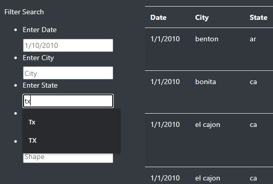
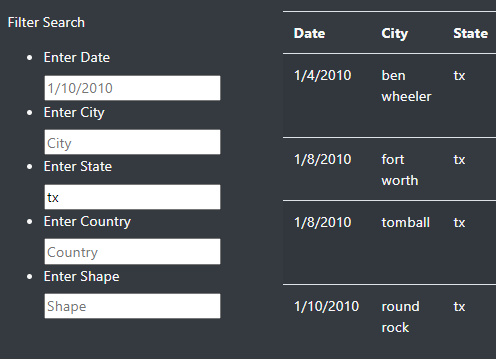

# UFOs
## Purpose
The purpose of this project was to create an interactive webpage that allows the user to filter through UFO sightings by date, city, state, country, and shape.
## Results
The webpage works well in filtering the results. The user simply needs to click into any of the filter fields, type in the value that they would like to use to filter the table, and then click out of the field or into a different one to apply the filters.

In this image you can see that the table is not filtered until the cursor is moved from the text field.
  
  
In this image I have clicked outside of the text field and the table is now filtered.

## Summary
The filters do work for this project, although there is room for some improvements. Here is a list of possible improvements to make the filters more user-friendly.  
  
 - Use drop down menus instead of text fields so that there is always at least one result.
 - Once a state is selected, then display the dropdown menu that contains all of the cities listed in that state to further refine the search.
 - Transform dates so they all have the same XX/XX/XXXX format.
 - Alter the listener to update after every keystroke to avoid any confusion in applying the filters without a button.

Overall the project was a success. We have created visually pleasing webpage that has a table populated with UFO sightings, and the ability to filter the table data by multiple parameters.
